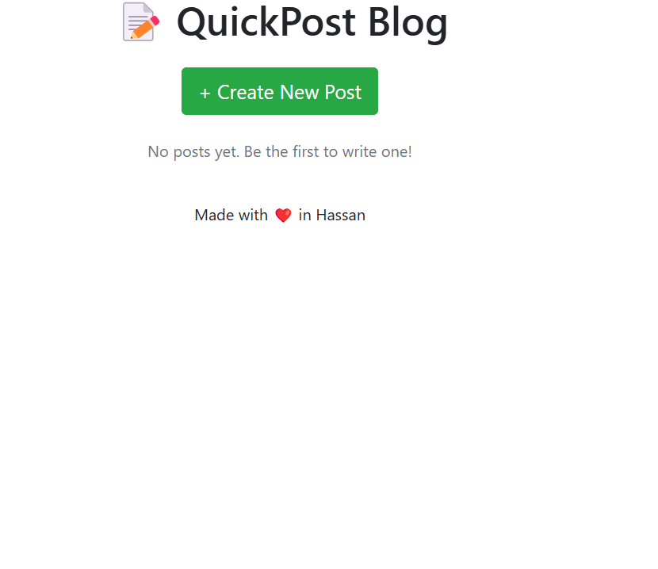
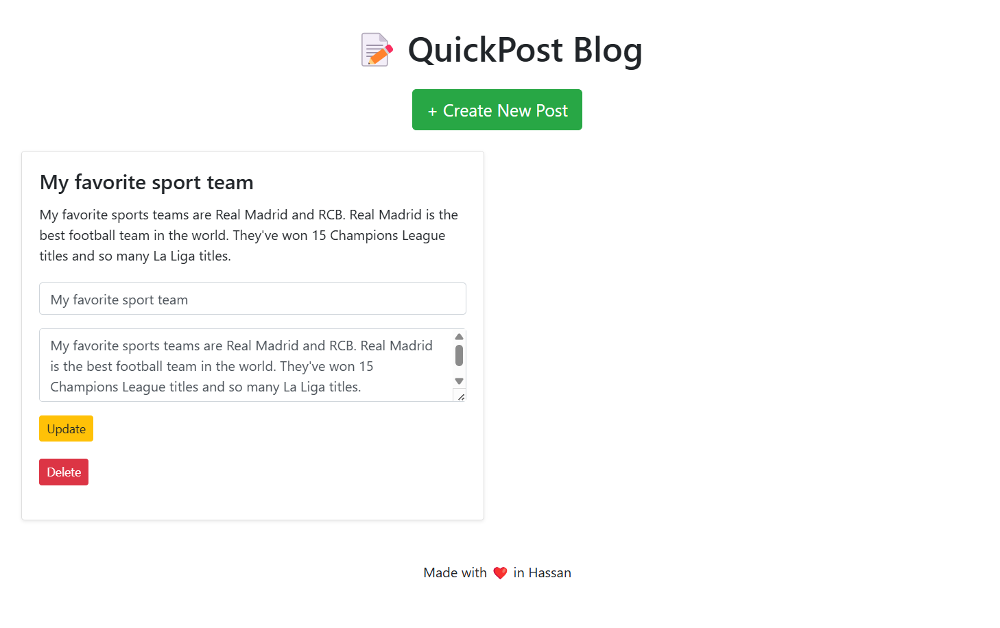

# Blog-Application
Blog Application using Node.js, Express.js , and EJS. No database involved.

QuickPost is a lightweight, full-stack blog application built using Node.js, Express, and EJS. Users can create, update, and delete blog posts directly from the interface. Posts are stored temporarily in memory (not in a database).

🛠️ Features
📝 Create new blog posts

✏️ Update existing posts

❌ Delete unwanted posts

🎨 Clean and responsive UI using Bootstrap

💡 Simple, beginner-friendly codebase

